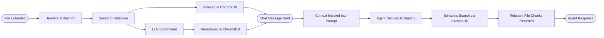

# Knowledge File Frontmatter

**Audience**: Product Managers, Managers, Architects
**Status**: Draft
**Date**: 2026-04-11
**Paired With**: [Technical](../technical/002-knowledge-frontmatter.md)

## Overview

When a file is uploaded to the knowledge base, the system extracts three pieces of metadata — a name, a description, and a set of tags — collectively called frontmatter. This metadata is first generated instantly using rules based on the file type (heuristics), then improved asynchronously by an LLM that reads the actual content. The enriched frontmatter serves two roles: it powers semantic search so the agent can find relevant files during a conversation, and it provides the agent with a readable catalog of what files are available so it knows when to go looking.

## System Flow

## What This Enables

- Files uploaded without meaningful names or structure are still discoverable — the LLM writes useful metadata regardless of filename.
- Images become searchable: the LLM describes visual content in detail, which gets embedded and matched against user queries.
- The agent can reason about what files exist before searching, reducing unnecessary tool calls.
- Frontmatter degrades gracefully — if LLM enrichment fails, heuristic metadata is used as a fallback.
- Metadata is kept in sync: when a file's content is updated, its ChromaDB index is rebuilt using the latest frontmatter.

## Why It Matters

The quality of frontmatter directly determines how well the agent can retrieve and cite uploaded files during a conversation. Poor or missing metadata means files sit in the knowledge base but never surface at the right moment. Good metadata — especially for images or opaquely-named files — means the agent can accurately match a user question to the right document even when the question uses different vocabulary than the file content itself.
