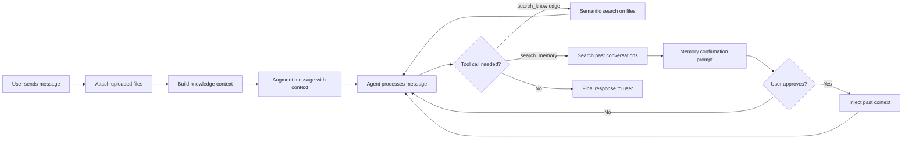

# Retrieval-Augmented Generation (RAG)

**Audience**: Product Managers, Managers, Architects
**Status**: Draft
**Date**: 2026-04-14
**Paired With**: [Technical](../technical/003-rag-retrieval-augmented-generation.md)

## Overview

When a user sends a message, the system does more than route it to an AI model. It first searches a knowledge base of uploaded files and, optionally, past conversations, then injects the relevant content directly into the context the model sees. This means the model responds with awareness of project documents, conversation-specific files, and prior interactions without the user having to repeat themselves. The process is automatic for file knowledge and opt-in for cross-conversation memory, where users confirm before past context is used.

## System Flow

## What This Enables

- Files uploaded to a conversation or project are automatically included as context, without the user referencing them explicitly.
- Semantic search lets the agent retrieve the most relevant excerpts from large knowledge bases rather than injecting everything blindly.
- Cross-conversation memory lets the agent surface insights from past sessions, with user confirmation before anything is used.
- Images are treated as first-class knowledge: vision analysis generates searchable descriptions that can be retrieved like any other file.
- The system works at two scopes: project-wide (shared across all conversations) and conversation-specific (private to one thread).

## Why It Matters

Without RAG, users must restate context every session and the model's responses are limited to what it was trained on. With it, the system accumulates domain knowledge over time, responds accurately to project-specific questions, and maintains continuity across conversations. The human-in-the-loop confirmation step for memory keeps users in control: the system never silently pulls in past context without consent.
