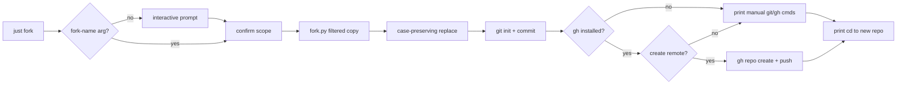

# Plan: `just fork` Scaffolding Clone

**Status**: Done
**Date**: 2026-04-08
**Author**: Jonas Avellana

## Overview

Contributors often bootstrap a new product repo from this template without carrying history, local caches, or install artifacts. The goal is a single `just fork` entry point that copies a sanitized tree to a sibling directory, renames the project identity from `scaffolding` to a chosen slug in a controlled way, initializes Git, and optionally creates and pushes a GitHub Enterprise repository when the GitHub CLI is available. Intent is to reduce manual find-and-replace mistakes, keep the scope of text changes auditable, and document the flow so reviewers can treat each phase as a small change set.

## Decisions Made

| #   | Decision                              | Choice                                                                                                                                                                                                                                                                                                                                                         |
| --- | ------------------------------------- | -------------------------------------------------------------------------------------------------------------------------------------------------------------------------------------------------------------------------------------------------------------------------------------------------------------------------------------------------------------- |
| 1   | Case-preserving replacement           | Preserve letter casing per occurrence so titles stay title case (`Scaffolding` to `ForkTitle`), package-style slugs stay lowercase (`scaffolding` to `fork-name`), and any all-caps token (`SCAFFOLDING`) would map consistently. This avoids broken branding in headings versus paths and keeps slug rules predictable without inventing a second name field. |
| 2   | Where does the copy run?              | Implement filtered copy in `scripts/lib/fork.py` next to replacement and `gh` detection so exclusions (`tmp/`, `logs/`, `__pycache__/`, `.venv`, `node_modules`, `.git`) live in one testable module rather than duplicated shell flags.                                                                                                                       |
| 3   | Which files receive text replacement? | Only the audited list plus the `.claude/agents/*.md` glob so unrelated vendored or generated content never changes. New hits are out of scope until someone extends the allowlist deliberately.                                                                                                                                                                |
| 4   | Interactive fork name                 | When no argument is passed, prompt in the terminal so ad hoc use stays ergonomic while CI or scripting can pass `--fork-name` later if we add it.                                                                                                                                                                                                              |
| 5   | GitHub Enterprise repo creation       | If `gh` is on `PATH` and authenticates, ask once whether to create a remote repo using the fork name, then run `gh repo create` (or the org-scoped variant we document) and push `main` (or default branch). If `gh` is missing, skip silently and print manual steps.                                                                                         |
| 6   | Orchestration surface                 | Root `justfile` delegates to `scripts/fork.just`, mirroring `scripts/mcp.just`, so fork stays discoverable without bloating the root file.                                                                                                                                                                                                                     |
| 7   | Confirmation gate                     | Always print destination path (`../fork-name`), replacement summary, and exclusions before copying so destructive mistakes require an explicit yes in the interactive path.                                                                                                                                                                                    |

## Target Folder Structure

```text
.
├── justfile                         # Adds fork recipe delegating to scripts/fork.just
├── scripts/
│   ├── fork.just                    # Invokes uv run python scripts/lib/fork.py with args
│   └── lib/
│       └── fork.py                  # Filtered copy, allowlisted replacement, git init helper, optional gh
└── docs/plans/004-fork-recipe.md    # This plan
```

## Implementation Phases

### Phase 1: Python core for copy, replacement, and safety `Done`

- [x] Add `scripts/lib/fork.py` with argparse: optional `--fork-name`, `--source`, `--dest-parent` defaulting to parent of cwd, dry-run flag if useful for tests, and `--yes` to skip interactive confirm when automation needs it.
- [x] Implement filtered directory copy that recreates the tree under `../fork-name` while skipping `.git`, `tmp/`, `logs/`, `__pycache__/`, `.venv`, and `node_modules` at any depth.
- [x] Implement case-preserving replacement over the allowlisted paths: `README.md`, `docs/index.md`, `mkdocs.yml`, `docs/plans/001-langgraph-introduction.md`, `src/web/src/components/Chat.tsx`, `src/web/src/App.test.tsx`, `src/app/main.py`, and every `.md` under `.claude/agents/`.
- [x] Add small pure functions for case mapping (title, lower, upper) plus tests that lock `Chat.tsx` and `App.test.tsx` strings together.

### Phase 2: Git init and GitHub CLI integration `Done`

- [x] After copy and replacement, run `git init` in the destination, create initial commit with a neutral message (for example `chore: initial import from scaffolding template`), and set `origin` only when the user accepts the `gh` prompt.
- [x] Detect `gh` via `shutil.which`; if present, after success prompt: whether to create a GHE repository for the fork name, then `gh repo create` with flags we document (private default unless policy says public), add remote, and `git push -u origin HEAD`.
- [x] If `gh` is absent or the user declines, print the exact `cd`, `git remote add`, and `gh repo create` commands they can run later.

### Phase 3: Just recipes and contributor docs `Done`

- [x] Add `scripts/fork.just` with a `fork` recipe that passes through argv to `uv run python scripts/lib/fork.py`.
- [x] Wire `fork` from the root `justfile` with a one-line `mod` include or equivalent delegate consistent with existing recipes.
- [x] Add a short paragraph to `README.md` (or setup doc if we keep README minimal) describing `just fork` and the sibling directory convention without duplicating this plan.

## Agent Execution Strategy

### Parallelism map

| Phase | Depends on | Agent type | Notes                         |
| ----- | ---------- | ---------- | ----------------------------- |
| 1     | None       | backend    | Pure Python, no external deps |
| 2     | Phase 1    | backend    | Needs fork.py working first   |
| 3     | Phase 1    | fullstack  | Can run parallel with Phase 2 |

### Sequencing constraints

- Phase 1 is the critical path: both Phase 2 and Phase 3 need `fork.py` to exist.
- Phases 2 and 3 can run in parallel after Phase 1 completes.

### Agent instructions

- **Backend agent (Phase 1)**: Build `scripts/lib/fork.py` using stdlib only (no new deps). Implement filtered copy, case-preserving replacement over allowlisted paths, and argparse CLI. Write tests for case mapping functions.
- **Backend agent (Phase 2)**: Add git init + `gh` CLI integration to `fork.py`. Use `shutil.which` for detection. Print manual commands as fallback.
- **Fullstack agent (Phase 3)**: Create `scripts/fork.just` and wire into root justfile following existing delegation pattern. Update docs.

## Dependencies

Runtime: Python 3 (already available via `uv`), standard library preferred inside `fork.py` so forking does not pull new packages. Optional: `gh` CLI for repository creation (user installs from [GitHub CLI](https://cli.github.com/manual)). No new `pyproject.toml` dependencies required if we stay stdlib plus subprocess for `git` and `gh`.

## Open Questions / Resolved Questions

Resolved: Replacement stays allowlisted rather than scanning the whole tree so binary assets and lockfiles stay untouched. Open: Exact `gh repo create` flags for org-owned GHE repos (org slug, visibility, default branch) should match internal runbooks before Phase 2 ships. Open: Whether plan documents under `docs/plans/` themselves should be rewritten in forks or left as historical references.

## Changelog

| Date       | Author         | Change                                                                                                  |
| ---------- | -------------- | ------------------------------------------------------------------------------------------------------- |
| 2026-04-08 | Jonas Avellana | Initial draft                                                                                           |
| 2026-04-10 | Claude         | Migrated to new plan format: added phase statuses, task checkboxes, agent execution strategy, changelog |
| 2026-04-10 | Claude         | Verified all phases complete, updated statuses to Done                                                  |


