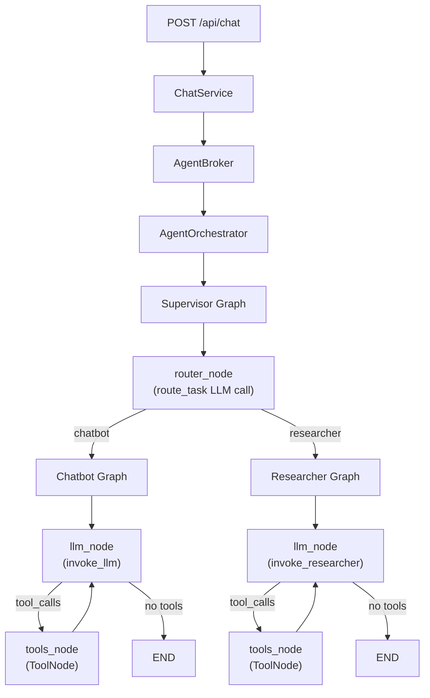
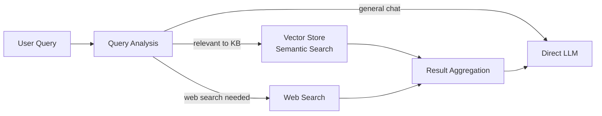

# Agentic Architecture Review: Technical Analysis

**Status:** Published
**Date:** 2026-04-11
**Author:** Claude (research review)
**Paired With:** [Functional: 001-agentic-architecture-review](../functional/001-agentic-architecture-review.md)

## Overview

A detailed technical review of the LangGraph multi-agent system in `src/app/agents/`, benchmarked against official LangGraph documentation, LangSmith best practices, and production-grade open-source references. Each section covers what exists today, what the industry recommends, and specific changes to consider.

## Architecture Diagram



______________________________________________________________________

## 1. Agent-by-Agent Review

### 1.1 Supervisor (`src/app/agents/supervisor/`)

**What it does well:**

- Clean routing via single LLM call in `route_task()`, conditional edge reads stable state via `decide_next()`
- Subgraph delegation with state projection: chatbot and researcher receive only the fields they need
- Follows the one-authoritative-routing-step convention from `langgraph-conventions.md`

**Gaps and recommendations:**

| Issue                      | Detail                                                                                                                | Fix                                                                                                                              |
| -------------------------- | --------------------------------------------------------------------------------------------------------------------- | -------------------------------------------------------------------------------------------------------------------------------- |
| Only two routes            | Supervisor only routes to chatbot or researcher. Adding agents requires modifying the routing prompt and graph edges. | Consider a registry pattern where agents self-declare their capabilities, and the routing prompt is generated from the registry. |
| No fallback route          | If the LLM returns an unexpected agent name, `decide_next()` could route to a nonexistent node.                       | Add a default/fallback that routes to chatbot, and log a warning.                                                                |
| State projection is manual | Each subgraph invocation manually constructs the input dict.                                                          | This is fine at 2 agents but will become a maintenance burden. The broker pattern partially addresses this.                      |

**Reference pattern (LangGraph docs):** The official supervisor example uses `Command(goto=agent_name)` for handoffs ([Hierarchical Agent Teams Tutorial](https://langchain-ai.github.io/langgraph/tutorials/multi_agent/hierarchical_agent_teams/)). Your implementation uses conditional edges from a routing function, which is equally valid but slightly more verbose.

### 1.2 Chatbot (`src/app/agents/chatbot/`)

**What it does well:**

- Rich tool set: file ops, calculator, web search, skill loader, knowledge reader
- Progressive skill loading: agent sees catalog first, loads full instructions on demand
- Knowledge catalog injected into system prompt for context-aware responses
- Clean separation: `invoke_llm()` handles prompt assembly, `should_continue()` handles routing

**Gaps and recommendations:**

| Issue                           | Detail                                                                                                                                                                              | Fix                                                                                                                                                                          |
| ------------------------------- | ----------------------------------------------------------------------------------------------------------------------------------------------------------------------------------- | ---------------------------------------------------------------------------------------------------------------------------------------------------------------------------- |
| No `handle_tool_errors=True`    | `ToolNode(ALL_TOOLS)` does not set error handling. A tool exception crashes the graph run. ([ToolNode API Reference](https://langchain-ai.github.io/langgraph/reference/prebuilt/)) | Set `ToolNode(ALL_TOOLS, handle_tool_errors=True)`. The error message gets sent back to the LLM as a tool response, letting it retry or explain the failure.                 |
| No `max_steps` guard            | The LLM-tool loop has no hard cap. A model that keeps calling tools will loop indefinitely.                                                                                         | Add a `steps: int` counter to `ChatbotState`, increment in `llm_node`, and add a conditional edge that routes to END when `steps >= MAX_STEPS`.                              |
| Knowledge catalog scales poorly | The full catalog is injected into the system prompt as text. With many files, this eats context window.                                                                             | Move to RAG: embed knowledge files in a vector store, retrieve top-k relevant chunks per query, inject only those. Keep the `read_knowledge_file` tool for full-file access. |
| `search_web` is a mock          | Returns hardcoded results.                                                                                                                                                          | Integrate a real search provider. Tavily has a LangChain integration ([Tavily Integration](https://python.langchain.com/docs/integrations/tools/tavily_search/)).            |

### 1.3 Researcher (`src/app/agents/researcher/`)

**What it does well:**

- Focused agent with single tool (web search), clear persona
- Structured research process defined in prompt (break query, search, cross-reference, synthesize)

**Gaps and recommendations:**

| Issue                                   | Detail                                                                                                                                                                                                                                                                               | Fix                                                                                                                                    |
| --------------------------------------- | ------------------------------------------------------------------------------------------------------------------------------------------------------------------------------------------------------------------------------------------------------------------------------------ | -------------------------------------------------------------------------------------------------------------------------------------- |
| `ChatOpenAI` type hint in `graph.py:17` | `def create_researcher_graph(llm: ChatOpenAI)` violates the `BaseChatModel` convention in `langgraph-conventions.md`. ([BaseChatModel API Reference](https://python.langchain.com/api_reference/core/language_models/langchain_core.language_models.chat_models.BaseChatModel.html)) | Change to `BaseChatModel` from `langchain_core.language_models.chat_models`.                                                           |
| Only one tool                           | Researcher can only search the web. No access to knowledge base, no ability to read URLs, no document analysis.                                                                                                                                                                      | Add tools: `read_knowledge_file` (access uploaded docs), a URL reader/scraper, and optionally a summarization tool for long documents. |
| No `handle_tool_errors=True`            | Same issue as chatbot.                                                                                                                                                                                                                                                               | Same fix.                                                                                                                              |
| No `max_steps` guard                    | Same issue as chatbot.                                                                                                                                                                                                                                                               | Same fix.                                                                                                                              |
| No findings accumulation                | `ResearcherState` has a `findings: list[str]` field but no node writes to it.                                                                                                                                                                                                        | Either use it (accumulate search results across iterations for synthesis) or remove the dead field.                                    |
| Import violation                        | `graph.py` imports `ChatOpenAI` from `langchain_openai`.                                                                                                                                                                                                                             | Import `BaseChatModel` from `langchain_core` instead.                                                                                  |

______________________________________________________________________

## 2. Orchestration Layer Review

### 2.1 AgentOrchestrator

**What it does well:**

- Centralizes timing, structured logging, and error handling for all agent invocations
- Clean `invoke_with_telemetry()` API with operation names and log context
- Re-raises exceptions with timing context attached

**No significant gaps.** This is a solid infrastructure service.

### 2.2 AgentBroker

**What it does well:**

- Translates domain language to graph state schema
- Services never build state dicts directly

**Minor gap:** The `voice_transcribe` method references `voice_result_mapper` but there's no voice agent or graph. This appears to be scaffolding for a future feature. Consider removing dead code or marking it explicitly as a stub.

### 2.3 AgentOutputParser

**What it does well:**

- Isolates LangChain message attribute access (`.content`, `.tool_calls`) from services
- Pure static methods, easy to test

**No significant gaps.**

______________________________________________________________________

## 3. Tools Review

### 3.1 Current Tool Inventory

| Tool                  | Agent               | Status   | Notes                                           |
| --------------------- | ------------------- | -------- | ----------------------------------------------- |
| `search_web`          | Chatbot, Researcher | Mock     | Returns hardcoded results                       |
| `read_file`           | Chatbot             | Working  | Path-sandboxed to project root                  |
| `list_directory`      | Chatbot             | Working  | Path-sandboxed                                  |
| `calculate`           | Chatbot             | Working  | Safe eval with math namespace                   |
| `load_skill`          | Chatbot             | Working  | Progressive skill loading                       |
| `read_skill_file`     | Chatbot             | Working  | Reads files from skill dirs                     |
| `read_knowledge_file` | Chatbot             | Working  | Reads full file by ID from DB                   |
| `describe_image`      | Available as skill  | Declared | Listed in skills but not wired as a direct tool |

### 3.2 Recommendations

**Missing tools worth considering:**

| Tool                   | Purpose                                                  | Complexity                                              |
| ---------------------- | -------------------------------------------------------- | ------------------------------------------------------- |
| URL reader/scraper     | Let researcher read web pages from search results        | Low (use `WebBaseLoader` or `requests` + BeautifulSoup) |
| Code execution sandbox | Safe Python/JS execution for data analysis tasks         | Medium (use `PythonREPLTool` with restrictions)         |
| Memory/note tool       | Let agents store and retrieve working notes across turns | Low (write to `Store` or state)                         |
| Knowledge search       | Semantic search over knowledge base (vs. full-file read) | Medium (requires vector store)                          |

**Tool docstring quality:** The existing tools have good docstrings that describe when to call them. This aligns with the LangGraph recommendation that tool docstrings serve as a contract with the model.

______________________________________________________________________

## 4. Knowledge Base Review

### 4.1 Current Implementation

The knowledge base stores uploaded files (markdown, text, JSON, YAML, images) with metadata:

- Heuristic frontmatter generation (name, description, tags extracted from content)
- Optional LLM enrichment for better metadata
- Two scopes: project-wide and conversation-specific
- Catalog injected into system prompt as formatted text
- `read_knowledge_file` tool for full-file access by ID

### 4.2 Scaling Problem

The current approach injects the full catalog into the system prompt. With the 500KB file limit and 50 files per project, the catalog text alone could consume significant context window. The LLM sees metadata for every file on every turn, regardless of relevance. Research shows that accuracy degrades when relevant information is buried in large contexts ("lost in the middle" problem), and RAG pipelines outperform full-context injection on cost and latency for most retrieval workloads ([RAG vs Long Context Windows, Redis](https://redis.io/blog/rag-vs-large-context-window-ai-apps/)).

### 4.3 Recommended: Adaptive RAG Pattern ([LangGraph Adaptive RAG Tutorial](https://langchain-ai.github.io/langgraph/tutorials/rag/langgraph_adaptive_rag/))



**Implementation steps:**

1. **Embed knowledge files** on upload using `text-embedding-3-small` (or similar). Store embeddings in ChromaDB (simple, file-based) or PGVector (if moving to PostgreSQL).
1. **Replace catalog injection** with a `search_knowledge` tool that performs semantic search and returns top-k chunks with metadata.
1. **Keep `read_knowledge_file`** for when the agent needs the full document after finding it via search.
1. **Add query routing** in the supervisor: if the query relates to uploaded knowledge, route through retrieval first.

**Why this matters:** Prompt injection of catalogs is O(n) in files. Vector search is O(1) at query time. The current approach hits a wall around 20-30 files with detailed metadata.

______________________________________________________________________

## 5. Checkpointing and Memory

LangGraph's persistence model saves graph state at every super-step, enabling conversation continuity, fault recovery, and time-travel debugging ([Persistence Concepts](https://langchain-ai.github.io/langgraph/concepts/persistence/), [Persistence How-To](https://langchain-ai.github.io/langgraph/how-tos/persistence/)).

### 5.1 Current State: No Checkpointing

The system has no LangGraph checkpointer. Consequences:

- **No conversation memory within the graph.** The service layer handles conversation persistence via the database, but the graph itself starts fresh every invocation. Prior messages are passed in via the state dict.
- **No fault recovery.** If an agent crashes mid-run, there is no checkpoint to resume from.
- **No time-travel debugging.** Cannot inspect intermediate graph states.

### 5.2 Recommended: Add Checkpointing

```python
# Dev
from langgraph.checkpoint.sqlite.aio import AsyncSqliteSaver
checkpointer = AsyncSqliteSaver.from_conn_string("data/checkpoints.db")

# Production
from langgraph.checkpoint.postgres.aio import AsyncPostgresSaver
checkpointer = AsyncPostgresSaver.from_conn_string(postgres_url)

# Compile with checkpointer
graph = supervisor_graph.compile(checkpointer=checkpointer)
```

**Thread mapping:** Map your existing `conversation_id` to LangGraph's `thread_id` in the config:

```python
config = {"configurable": {"thread_id": conversation_id}}
result = await graph.ainvoke(state, config)
```

This gives you automatic conversation continuity within the graph, checkpoint-based fault recovery, and `get_state_history()` for debugging.

### 5.3 Cross-Thread Memory via Stores

LangGraph's `Store` interface enables memory that persists across conversations ([Memory Concepts](https://langchain-ai.github.io/langgraph/concepts/memory/), [LangMem Library](https://langchain-ai.github.io/langmem/)):

```python
from langgraph.store.memory import InMemoryStore

store = InMemoryStore(
    index={
        "embed": init_embeddings("openai:text-embedding-3-small"),
        "dims": 1536,
        "fields": ["content"],
    }
)
graph = supervisor_graph.compile(checkpointer=checkpointer, store=store)
```

This could complement or eventually replace parts of your custom knowledge base, giving agents semantic search over stored memories.

______________________________________________________________________

## 6. Error Handling and Resilience

### 6.1 Current State

- `AgentOrchestrator` wraps `ainvoke()` in try/except with timing logs, then re-raises
- No tool-level error handling
- No retry logic
- No circuit breakers

### 6.2 Recommended Improvements

**Immediate (low effort):**

```python
# In every graph that creates a ToolNode:
tool_node = ToolNode(tools, handle_tool_errors=True)
```

This single change means tool exceptions become error messages sent back to the LLM, which can then decide to retry with different parameters or explain the failure to the user.

**Add max_steps to prevent runaway loops** ([Recursion Limit How-To](https://langchain-ai.github.io/langgraph/how-tos/recursion-limit/), [GraphRecursionError Reference](https://langchain-ai.github.io/langgraph/troubleshooting/errors/)):

```python
class ChatbotState(MessagesState):
    images: list[str]
    skill_context: str
    knowledge_catalog: str
    steps: int  # NEW

MAX_STEPS = 10

async def llm_node(state: ChatbotState) -> dict:
    result = await invoke_llm(state, llm)
    result["steps"] = state.get("steps", 0) + 1
    return result

def should_continue(state: ChatbotState) -> str:
    if state.get("steps", 0) >= MAX_STEPS:
        return NODE_END
    # ... existing tool_calls check
```

**Future (medium effort):**

- Add retry state (`retry_count`) for specific tool failures
- Implement exponential backoff for external API calls (web search, LLM)
- Add circuit breaker pattern for when a tool repeatedly fails ([Circuit Breaker Pattern, Azure Architecture Center](https://learn.microsoft.com/en-us/azure/architecture/patterns/circuit-breaker))

______________________________________________________________________

## 7. Streaming

### 7.1 Current State: No Streaming

The API returns a complete response after the full graph run finishes. Users see nothing until the entire agent loop completes.

### 7.2 Recommended: LangGraph Streaming

LangGraph supports multiple stream modes that can be combined ([Streaming Concepts](https://langchain-ai.github.io/langgraph/cloud/concepts/streaming/), [Stream Values How-To](https://langchain-ai.github.io/langgraph/how-tos/stream-values/)):

| Mode         | What it streams                 | Use case                |
| ------------ | ------------------------------- | ----------------------- |
| `"messages"` | LLM tokens as they're generated | Real-time typing effect |
| `"updates"`  | Node-level state updates        | Progress indicators     |
| `"values"`   | Full state after each step      | Debugging               |

**Implementation approach:**

1. Add an SSE endpoint (`GET /api/chat/stream`) alongside the existing POST endpoint
1. Use `graph.astream()` or `graph.astream_events()` instead of `ainvoke()`
1. Stream tokens to the frontend via Server-Sent Events

```python
async def stream_chat(request: ChatRequestDTO):
    async for event in graph.astream(state, config, stream_mode="messages"):
        yield f"data: {json.dumps(event)}\n\n"
```

This is a significant UX improvement, especially for longer agent runs involving multiple tool calls.

______________________________________________________________________

## 8. Observability

### 8.1 Current State

The project uses `structlog` for structured logging throughout, with the orchestrator providing centralized timing and operation tracking. This is solid for application-level observability.

### 8.2 Recommended: Add LangSmith Tracing

LangSmith provides agent-specific observability that structlog cannot: nested span trees for LLM calls, tool invocations, and graph transitions; token usage and cost tracking; trace-based evaluation datasets ([LangSmith Observability](https://docs.smith.langchain.com/observability)).

**Setup (minimal):**

```bash
# .env
LANGSMITH_TRACING=true
LANGSMITH_API_KEY=lsv2_...
LANGSMITH_PROJECT=scaffolding
```

No code changes required for basic tracing. LangChain/LangGraph operations are automatically captured ([Tracing LangGraph Apps](https://docs.smith.langchain.com/observability/how_to_guides/trace_with_langgraph)).

**Enhanced tracing with metadata:**

```python
config = {
    "configurable": {"thread_id": conversation_id},
    "run_name": operation_name,
    "tags": ["production"],
    "metadata": {"conversation_id": cid, "user_id": uid},
}
```

**Trade-off:** LangSmith is a hosted service (data leaves your infrastructure). If privacy is a concern, the structlog approach is fine for now. Consider self-hosted alternatives like Langfuse or Phoenix (Arize) for open-source tracing.

______________________________________________________________________

## 9. Convention Violations Found

| File                                    | Violation                                                   | Rule                                                                                  |
| --------------------------------------- | ----------------------------------------------------------- | ------------------------------------------------------------------------------------- |
| `src/app/agents/researcher/graph.py:17` | Type hint `ChatOpenAI` instead of `BaseChatModel`           | `langgraph-conventions.md`: "Never annotate ChatOpenAI"                               |
| `src/app/agents/researcher/graph.py:4`  | Imports `ChatOpenAI` from `langchain_openai`                | `agent-conventions.md`: "All LLM access goes through `src/app/shared/llm.py` factory" |
| `src/app/agents/researcher/state.py`    | `findings: list[str]` field is never written to by any node | Dead code                                                                             |

______________________________________________________________________

## 10. Comparison with Production References

### LangGraph Official Examples

| Pattern              | Official Example                              | Your Implementation                | Delta   |
| -------------------- | --------------------------------------------- | ---------------------------------- | ------- |
| Checkpointing        | `PostgresSaver` with thread-based persistence | None                               | Missing |
| Tool error handling  | `handle_tool_errors=True`                     | Not set                            | Missing |
| Streaming            | `astream()` with multiple modes               | Not implemented                    | Missing |
| Human-in-the-loop    | `interrupt()` + `Command(resume=)`            | Not implemented                    | Missing |
| State reducers       | `Annotated[list, add_messages]`               | Used correctly via `MessagesState` | Aligned |
| Subgraph composition | Compiled subgraphs invoked from supervisor    | Used correctly                     | Aligned |

### FastAPI + LangGraph Production Template (wassim249/fastapi-langgraph-agent-production-ready-template)

| Feature              | Template            | Your Implementation | Delta                       |
| -------------------- | ------------------- | ------------------- | --------------------------- |
| Auth middleware      | JWT + API key       | None                | Missing (may not be needed) |
| Rate limiting        | Per-endpoint limits | None                | Missing                     |
| Health checks        | `/health` endpoint  | Not observed        | Missing                     |
| Metrics (Prometheus) | Built-in            | None                | Missing                     |
| PostgreSQL           | Primary DB          | SQLite              | Simpler, fine for dev       |
| Structured logging   | Pino/structlog      | structlog           | Aligned                     |

______________________________________________________________________

## 11. Alternative Architectures Worth Considering

### 11.1 Swarm Pattern (Instead of Supervisor)

LangGraph's `langgraph-swarm` library ([GitHub](https://github.com/langchain-ai/langgraph-swarm-py)) enables agents to hand off to each other directly via explicit handoff tools, without a central supervisor. The system remembers the last-active agent so follow-up messages continue seamlessly. OpenAI's original Swarm framework ([GitHub](https://github.com/openai/swarm)) explored the same concept as an educational reference.

**When to consider:** If you add 4+ agents and the supervisor routing prompt becomes complex. Swarm reduces the single-point-of-failure risk of the supervisor.

**Trade-off:** Harder to debug, less predictable control flow. Your current 2-agent setup is too small to benefit.

### 11.2 Orchestrator-Worker Pattern (Instead of Simple Routing)

The orchestrator-worker pattern has the supervisor LLM dynamically decompose tasks into subtasks, assign them to workers, and synthesize results. Unlike simple routing (which picks one agent), this pattern can invoke multiple agents for a single query.

**When to consider:** If users ask complex questions that need both research AND chatbot capabilities in one turn.

### 11.3 Plan-and-Execute Pattern

A planning agent creates a step-by-step plan, then an execution agent carries out each step. Human-in-the-loop approval can gate each step.

**When to consider:** For complex, multi-step research tasks where the user wants visibility into the agent's plan before execution.

______________________________________________________________________

## 12. Priority Roadmap

### Immediate (Low Effort, High Impact)

1. **Fix convention violations**: Change `ChatOpenAI` to `BaseChatModel` in researcher graph, remove dead `findings` field or use it
1. **Enable tool error handling**: Add `handle_tool_errors=True` to all `ToolNode` instances
1. **Add max_steps**: Prevent runaway tool-calling loops in chatbot and researcher
1. **Add LangSmith tracing**: Environment variables only, zero code changes for basic tracing

### Short-Term (Medium Effort)

5. **Add checkpointing**: `AsyncSqliteSaver` for dev, map `conversation_id` to `thread_id`
1. **Replace mock web search**: Integrate Tavily or similar real search provider
1. **Add streaming endpoint**: SSE-based streaming for real-time responses
1. **Give researcher more tools**: URL reader, knowledge base access

### Long-Term (High Effort)

9. **Implement RAG for knowledge base**: Vector store embeddings, semantic search tool, replace catalog prompt injection
1. **Add human-in-the-loop**: Approval workflows for sensitive operations using `interrupt()` ([HITL Concepts](https://langchain-ai.github.io/langgraph/concepts/human_in_the_loop/))
1. **Cross-thread memory via Stores**: Persistent agent memory across conversations
1. **Evaluate swarm pattern**: If agent count grows beyond 4-5

______________________________________________________________________

## Sources

### Official LangGraph Documentation

- [Persistence Concepts](https://langchain-ai.github.io/langgraph/concepts/persistence/): checkpointers, thread-based state, SqliteSaver, PostgresSaver
- [Persistence How-To](https://langchain-ai.github.io/langgraph/how-tos/persistence/): adding thread-level persistence to graphs
- [ToolNode API Reference](https://langchain-ai.github.io/langgraph/reference/prebuilt/): `handle_tool_errors` parameter documentation
- [Streaming Concepts](https://langchain-ai.github.io/langgraph/cloud/concepts/streaming/): values, updates, messages, events, debug stream modes
- [Stream Values How-To](https://langchain-ai.github.io/langgraph/how-tos/stream-values/): streaming full graph state
- [Human-in-the-Loop Concepts](https://langchain-ai.github.io/langgraph/concepts/human_in_the_loop/): `interrupt()`, approve/reject, edit state patterns
- [Memory Concepts](https://langchain-ai.github.io/langgraph/concepts/memory/): checkpointers (thread-scoped) vs Store (cross-thread)
- [Recursion Limit How-To](https://langchain-ai.github.io/langgraph/how-tos/recursion-limit/): setting `recursion_limit`, `RemainingSteps` annotation
- [GraphRecursionError Reference](https://langchain-ai.github.io/langgraph/troubleshooting/errors/): default limit of 25, error handling
- [Hierarchical Agent Teams Tutorial](https://langchain-ai.github.io/langgraph/tutorials/multi_agent/hierarchical_agent_teams/): supervisor with mid-level and top-level routing
- [Multi-Agent Collaboration Tutorial](https://langchain-ai.github.io/langgraph/tutorials/multi_agent/multi-agent-collaboration/): divide-and-conquer multi-agent networks
- [Adaptive RAG Tutorial](https://langchain-ai.github.io/langgraph/tutorials/rag/langgraph_adaptive_rag/): query-routed retrieval with self-correcting document grading
- [Self-RAG Tutorial](https://langchain-ai.github.io/langgraph/tutorials/rag/langgraph_self_rag_local/): corrective RAG with self-reflection using local LLMs

### Official LangChain Documentation

- [BaseChatModel API Reference](https://python.langchain.com/api_reference/core/language_models/langchain_core.language_models.chat_models.BaseChatModel.html): abstract base class for provider-agnostic typing
- [Chat Models Concepts](https://python.langchain.com/docs/concepts/chat_models/): `configurable_alternatives()` pattern for swappable providers
- [Tavily Search Integration](https://python.langchain.com/docs/integrations/tools/tavily_search/): setup and usage for web search tool

### LangSmith

- [LangSmith Observability](https://docs.smith.langchain.com/observability): tracing concepts, evaluation, production monitoring
- [Tracing LangGraph Apps](https://docs.smith.langchain.com/observability/how_to_guides/trace_with_langgraph): `LANGCHAIN_TRACING_V2`, API key setup
- [Tracing LangChain Apps](https://docs.smith.langchain.com/observability/how_to_guides/trace_with_langchain): `@traceable` decorator

### Industry References

- [Building Effective Agents](https://www.anthropic.com/research/building-effective-agents) (Anthropic): workflow vs agent tradeoffs, prompt chaining, routing, orchestrator-worker, evaluator-optimizer patterns
- [How to Build an Agent](https://blog.langchain.com/how-to-build-an-agent/) (LangChain Blog): iterative agent development methodology
- [RAG vs Long Context Windows](https://redis.io/blog/rag-vs-large-context-window-ai-apps/) (Redis): cost, latency, accuracy tradeoffs, "lost in the middle" problem
- [Circuit Breaker Pattern](https://learn.microsoft.com/en-us/azure/architecture/patterns/circuit-breaker) (Azure Architecture Center): Closed/Open/Half-Open state management for resilience
- [SSE for LLM Streaming](https://apidog.com/blog/stream-llm-responses-using-sse/): Server-Sent Events as the standard protocol for token-by-token LLM streaming

### GitHub Repositories

- [langgraph-supervisor-py](https://github.com/langchain-ai/langgraph-supervisor-py): official supervisor library for hierarchical multi-agent systems
- [langgraph-swarm-py](https://github.com/langchain-ai/langgraph-swarm-py): official swarm library for peer-to-peer agent handoffs
- [openai/swarm](https://github.com/openai/swarm): OpenAI's educational multi-agent orchestration framework
- [langgraph-101](https://github.com/langchain-ai/langgraph-101): hands-on tutorials for LangGraph fundamentals and multi-agent patterns
- [fastapi-langgraph-agent-production-ready-template](https://github.com/wassim249/fastapi-langgraph-agent-production-ready-template): production FastAPI template with auth, metrics, PostgreSQL
- [LangMem Library](https://langchain-ai.github.io/langmem/): semantic memory extraction and hot-path memory with LangGraph Store
