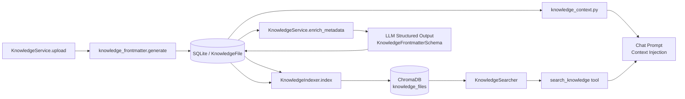
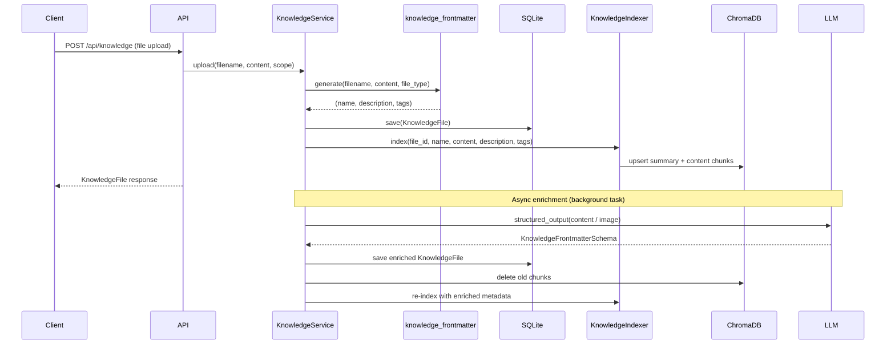

# Knowledge File Frontmatter

**Audience**: Architects, Engineers
**Status**: Draft
**Date**: 2026-04-11
**Paired With**: [Functional](../functional/002-knowledge-frontmatter.md)

## Overview

Frontmatter is the triplet `(name, description, tags)` extracted from every uploaded knowledge file. It is generated in two passes: a synchronous heuristic pass at upload time, and an asynchronous LLM enrichment pass that overwrites the heuristics with semantically richer metadata. The enriched frontmatter is then stored in the database and used to build a dedicated summary vector chunk in ChromaDB, which is what the `search_knowledge` tool matches against at query time. For conversation-scoped files, the description is also injected directly into every chat message as a manifest so the agent can decide whether to search without making a tool call first.

## Component View



## Request Flow



## Key Patterns

### Heuristic extraction by file type

`knowledge_frontmatter.generate()` dispatches to a per-extension handler:

| Extension | Name source                                 | Description source                 | Tags source                       |
| --------- | ------------------------------------------- | ---------------------------------- | --------------------------------- |
| `.md`     | First `# H1` heading, else filename stem    | First non-heading line (200 chars) | All `##`/`###` headings (up to 5) |
| `.txt`    | Filename stem                               | First non-empty line               | `["text"]`                        |
| `.json`   | `name` field if present, else filename stem | Top-level keys prefixed `Keys: `   | Top-level keys (up to 8)          |
| `.yml`    | Same as JSON                                | Same as JSON                       | Same as JSON                      |
| Image     | Filename stem                               | `"Image attached in conversation"` | `["image"]`                       |

### LLM enrichment

`knowledge_frontmatter_llm.llm_generate()` sends up to the first 4,000 characters of text content to the LLM with structured output bound to `KnowledgeFrontmatterSchema`. Images use `llm_describe_image()`, which sends the base64 payload via vision with a detailed analysis prompt covering subject, composition, color, technique, style, and mood. Both return `("", "", [])` on failure so the heuristic values are preserved.

```python
class KnowledgeFrontmatterSchema(BaseModel):
    name: str
    description: str
    tags: list[str]
```

### ChromaDB summary chunk

The indexer always creates one summary document per file before chunking the raw content:

```python
summary = f"{name}. {description} Tags: {tag1}, {tag2}, ..."
# Stored with doc_type="summary" metadata
```

This is the primary target for semantic search — queries match against the enriched summary first, then fall through to raw content chunks.

### Context injection for conversation files

`knowledge_context.build_conversation_context()` builds a lightweight manifest injected into every chat message:

```
[Conversation files:]
- "My Document": A one-sentence description of the file.
```

Project-scoped files get their full content injected via `build_project_context()`. Images always use description (never raw base64).

## Configuration Reference

| Variable                 | Default           | Purpose                                   |
| ------------------------ | ----------------- | ----------------------------------------- |
| `CHUNK_SIZE_CHARS`       | `1024`            | Max characters per content chunk          |
| `CHUNK_OVERLAP_CHARS`    | `512`             | Overlap between adjacent chunks           |
| `CONTENT_PREVIEW_CHARS`  | `4000`            | Max chars sent to LLM for text enrichment |
| `MAX_FILE_SIZE_BYTES`    | `512000` (500 KB) | Upload size limit for text files          |
| `MAX_PROJECT_FILES`      | `50`              | Max files per project scope               |
| `MAX_CONVERSATION_FILES` | `20`              | Max files per conversation scope          |

## Source Files

| File                                                  | Purpose                                           |
| ----------------------------------------------------- | ------------------------------------------------- |
| `src/app/service/knowledge_frontmatter.py`            | Heuristic extraction by file type                 |
| `src/app/service/knowledge_frontmatter_llm.py`        | LLM-powered enrichment and image description      |
| `src/app/service/knowledge.py`                        | Upload, update, delete, enrich orchestration      |
| `src/app/service/knowledge_context.py`                | Builds context strings injected into chat prompts |
| `src/app/infrastructure/vector/knowledge_indexer.py`  | Chunks content and upserts to ChromaDB            |
| `src/app/infrastructure/vector/knowledge_searcher.py` | Semantic search with scope fallback               |
| `src/app/agents/tools/knowledge.py`                   | `search_knowledge` agent tool                     |
