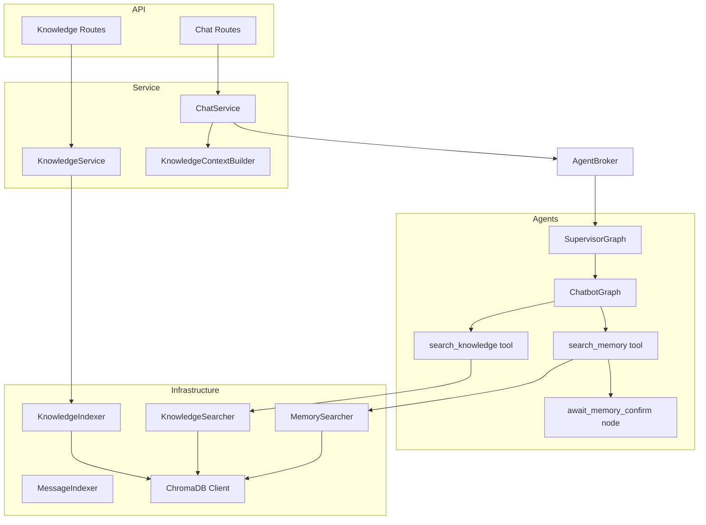
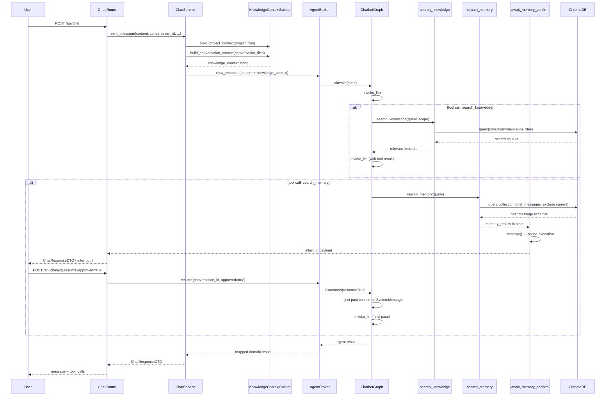

# Retrieval-Augmented Generation (RAG)

**Audience**: Architects, Engineers
**Status**: Draft
**Date**: 2026-04-14
**Paired With**: [Functional](../functional/003-rag-retrieval-augmented-generation.md)

## Overview

RAG is implemented across three infrastructure layers: `vector/` (ChromaDB indexing and search), `service/` (context assembly and augmentation), and `agents/` (tool-driven retrieval and HITL memory confirmation). Documents are indexed as multi-vector pairs (summary + content chunks) using `text-embedding-3-small`. At query time, the chat service builds knowledge context from uploaded files and appends it to the user message before agent invocation. The agent can also call `search_knowledge` and `search_memory` tools on demand, with the latter triggering a LangGraph `interrupt()` for user confirmation before any past context is injected.

## Component View



## Request Flow



## Key Patterns

**Multi-vector indexing:** each file produces two document types in ChromaDB — a summary vector (LLM-enriched name, description, tags) and content chunks (1024 chars, 512 overlap). This lets semantic search match on metadata intent and on raw content independently.

```python
# knowledge_indexer.py
summary_doc = {"id": f"{file_id}__summary", "doc_type": "summary", ...}
chunk_docs  = [{"id": f"{file_id}__chunk_{i}", "doc_type": "chunk", ...} for i in ...]
collection.upsert(documents=[summary_doc] + chunk_docs)
```

**Scope-aware retrieval:** `KnowledgeSearcher` applies ChromaDB `where` filters to limit results to the correct scope, and enforces per-scope relevance thresholds (0.3 for project, 0.15 for conversation).

```python
score = 1.0 - distance  # ChromaDB returns L2 distances
if score >= threshold:
    results.append(...)
```

**HITL interrupt/resume:** `await_memory_confirm` calls LangGraph's `interrupt()` to pause the graph mid-run. The orchestrator catches the interrupt, surfaces it through `ChatResponseDTO.interrupt`, and the frontend renders `MemoryConfirmCard`. Resuming sends a `Command(resume=approved)` to the checkpointed thread.

```python
# nodes.py
if state.get("memory_results"):
    interrupt({"type": "memory_confirm", "results": state["memory_results"], ...})
```

**Context injection strategy:** project files are injected as full content; conversation files as a manifest only (name + description), since their content is already in the message history. This controls token usage without sacrificing recall.

## Configuration Reference

| Variable             | Purpose                                        | Default               |
| -------------------- | ---------------------------------------------- | --------------------- |
| `chroma_path`        | ChromaDB persistent storage directory          | `data/chroma`         |
| `checkpoint_db_path` | LangGraph SQLite checkpoint path               | `data/checkpoints.db` |
| `database_url`       | SQLite app DB (conversations, knowledge_files) | `data/app.db`         |
| `llm_api_key`        | Embedding + LLM provider key                   | required              |
| `llm_base_url`       | OpenRouter or OpenAI base URL                  | required              |
| `llm_model`          | Model used for chat and enrichment             | required              |

## Source Files

| File                                                  | Purpose                                                           |
| ----------------------------------------------------- | ----------------------------------------------------------------- |
| `src/app/infrastructure/vector/client.py`             | Singleton ChromaDB PersistentClient, embedding function           |
| `src/app/infrastructure/vector/knowledge_indexer.py`  | Multi-vector upsert: summary + content chunks                     |
| `src/app/infrastructure/vector/knowledge_searcher.py` | Scope-aware semantic search with relevance filtering              |
| `src/app/infrastructure/vector/message_indexer.py`    | Index chat messages for cross-conversation memory                 |
| `src/app/infrastructure/vector/memory_searcher.py`    | Semantic search over past messages, excludes current conversation |
| `src/app/service/knowledge_context.py`                | Assembles knowledge context string from file metadata and content |
| `src/app/service/chat.py`                             | Orchestrates context building, augments message, triggers agent   |
| `src/app/agents/tools/knowledge.py`                   | `search_knowledge` LangChain tool                                 |
| `src/app/agents/tools/memory.py`                      | `search_memory` LangChain tool                                    |
| `src/app/agents/chatbot/nodes.py`                     | `invoke_llm`, `await_memory_confirm` nodes                        |
| `src/app/agents/chatbot/graph.py`                     | Chatbot graph definition, routing after tools                     |
| `src/app/agents/orchestrator/broker.py`               | `chat_response`, `resume` domain operations                       |
| `src/app/agents/orchestrator/orchestrator.py`         | `invoke_with_telemetry`, interrupt catching                       |
| `src/web/src/components/MemoryConfirmCard.tsx`        | HITL approval UI for memory results                               |
| `src/web/src/components/useChatSend.ts`               | `handleSend`, `handleResume` frontend state logic                 |
